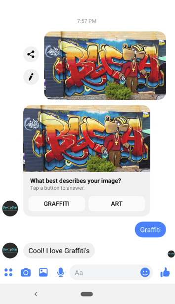

# WA Animals Messenger Bot

Facebook Messenger chatbot to handle a variety of common interactions required for WA Animals admin

## Screenshot Sample

## Guide

* [01 - Webhook Base Setup](instructions/01_webhook_base.md)
* [02 - Webhook Deploy to AWS](instructions/02_webhook_deploy_aws.md)
* [03 - Facebook Page Setup](instructions/03_facebook_page_setup.md)
