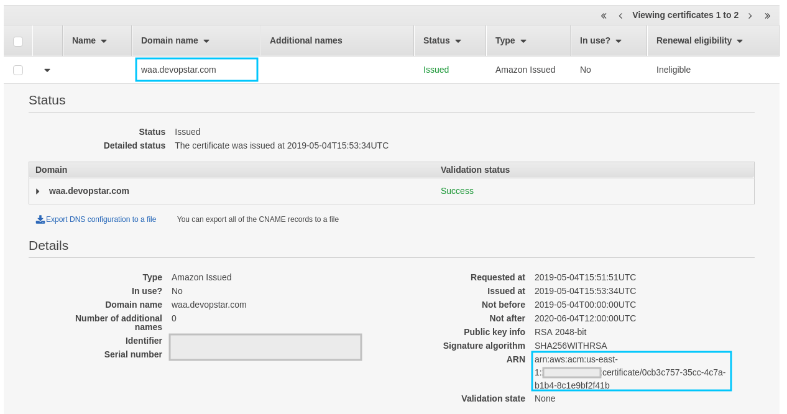
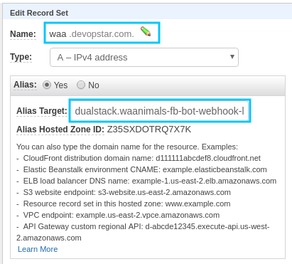

# Webhook Hosting on AWS

We'll deploy our service using CloudFormation to AWS Fargate

## Containerize Webhook

### Auth Docker to ECR

```bash
# MacOS or Linux
$(aws ecr get-login --no-include-email --region us-east-1)

# Windows
Invoke-Expression -Command (aws ecr get-login --no-include-email --region us-east-1)
```

### Quick Start

Build and push the containers

```bash
./container_push.sh
```

## Certificate

You will need an issued certificate through ACM to integrate SSL into the endpoint correctly.



Take the Certificate ARN and note it down for the next step.

## CloudFormation Deploy

First make adjustments in `cloudformation/deployment-params.json` ensuring the `FbVerifyToken` parameter matches your generated key from before.

Also ensure that the `CertificateArn` is setup with the previous value from the last step.

Then deploy the nested templates to S3

```bash
./cloudformation_deploy.sh
```

Then run the following to deploy

### Create

```bash
aws cloudformation create-stack \
    --stack-name "waanimals-fb-bot" \
    --template-body file://cloudformation/deployment.yaml \
    --parameters file://cloudformation/deployment-params.json \
    --capabilities CAPABILITY_IAM \
    --region us-east-1
```

### Update

```bash
aws cloudformation update-stack \
    --stack-name "waanimals-fb-bot" \
    --template-body file://cloudformation/deployment.yaml \
    --parameters file://cloudformation/deployment-params.json \
    --capabilities CAPABILITY_IAM \
    --region us-east-1
```

## Route53

You need to point your registered domain to point at the deployed ALB. Do this within Route53


