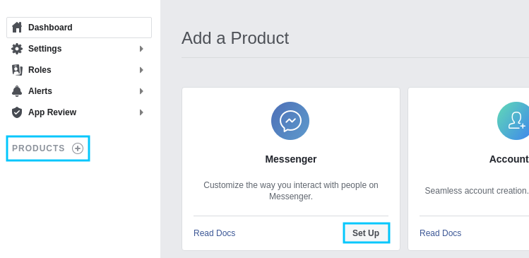
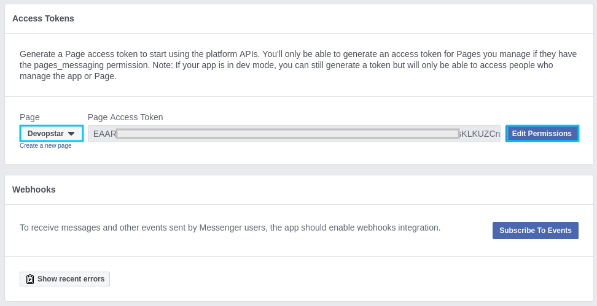
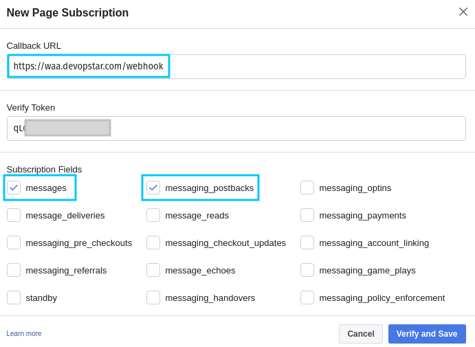
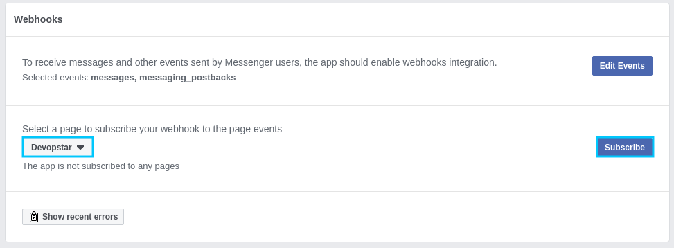

# Facebook Page Setup

Based heavily on [Setting Up Your Facebook App
](https://developers.facebook.com/docs/messenger-platform/getting-started/app-setup)

## Add the Messenger Platform to your Facebook app

Select `PRODUCTS` and then setup `Messenger`

Create an access token for your selected page

Edit the permissions and add your `Webhook URL` and `Verify Token`

Finally, subscribe your page to the Webhook events

